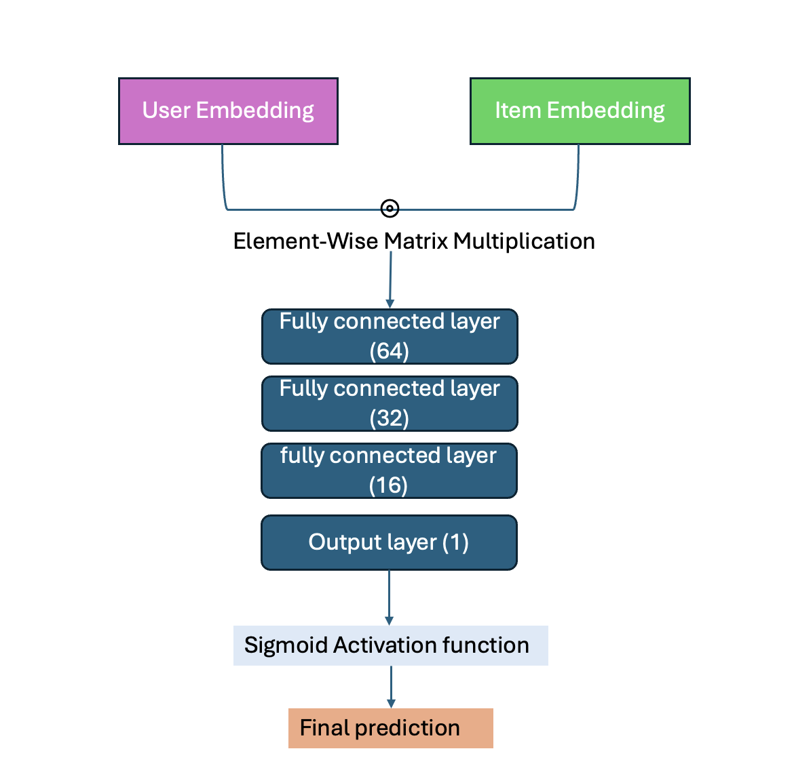

# GMF_NN
The GMF-NN model is an enhancement of Generalized Matrix Factorization (GMF), integrating deep neural networks to improve its predictive capabilities for recommendation systems. GMF is a fundamental approach in collaborative filtering, where user and item interactions are modeled using element-wise multiplicative embedding representations.

